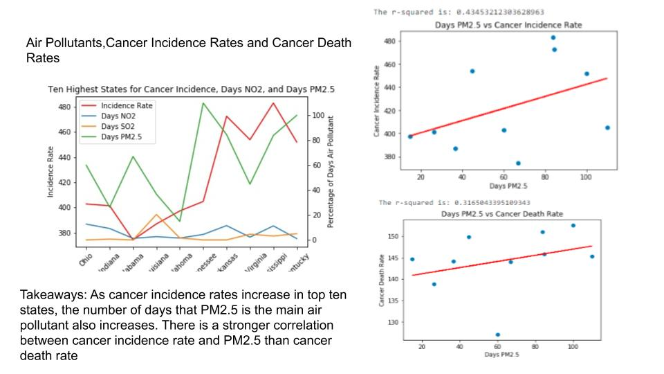

# Row-2-Group-Project

Data Analytics Group Project

Overview:

Nonbiological data was used in this group project to determine whether there were differences between cancer incidence rates and cancer mortality rates

The data we explored to make the above determination was:

- Air quality data
- Employment data by sector
- Medical insurance rate data
- Household income data
- Lifestyle data

How to Run Code:

1). Clone the Github repository into a folder in your local

2). Open Jupyter Lab (May need to install Anaconda in order to do this)

3). Navigate to Row-2-Group-Project/Final Result/Analysis_cancer.ipynb

3). Run all cells by clicking on Run>Run all cells

Data Analysis:

- Cancer mortality and cancer incidence rates were joined in with nonbiological data.

- Pandas and Matplotlib was used to clean, manipulate, and join all datasets in order to

- Create scatter plots and r squared values

Screenshots:

This chart demonstrates the weight that various lifestyle factors can have on cancer incidence rate. We used this chart type because we wanted the user to be able to view all lifestyle factors we looked into and their corresponding weight on cancer incidence rate in a clear, quick way.

This chart demonstrates that there is little correlation between household income and cancer death rate. A scatter plot was selected because that is the one of the best charts that can be used for a correlation visualization.

These graphs demonstrate the correlations between various air pollutants and cancer incidence and cancer death rates. The images on the right demonstrate the relationship between PM2.5 and all states in the United States and the image on the right only looks at select states along with SO2, NO2, and PM2.5. A line chart was used to see if cancer incidence rate increased over time with increased exposure to air pollutants and scatter plots were used to demonstrate individual air pollutant correlations. 

Findings:

- There is a correlation between percentage of manufacturing jobs and
  cancer incidence rates-chemical manufacturing shows the highest r squared value

- There is a correlation between cancer incidence rate and concentration of PM 2.5

